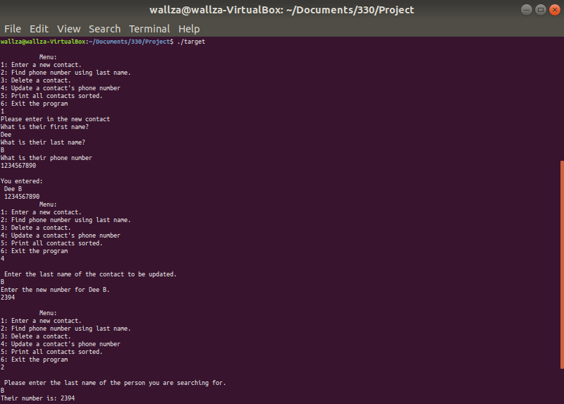
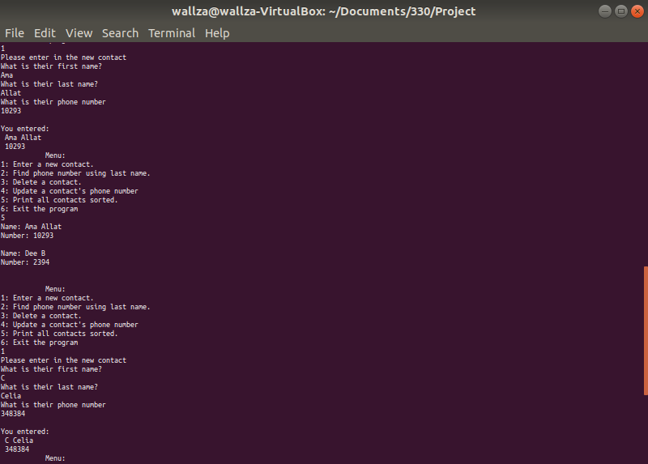
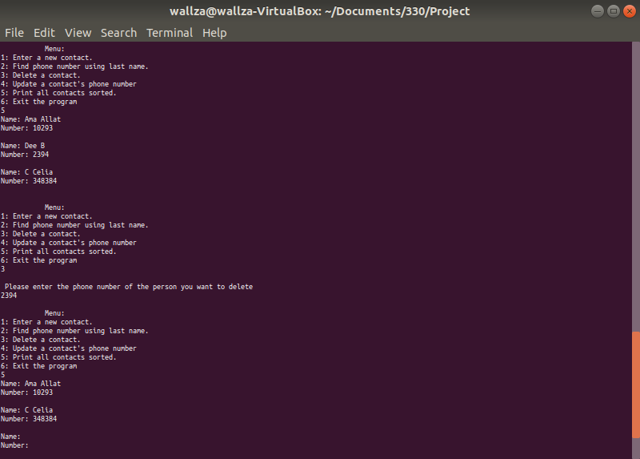
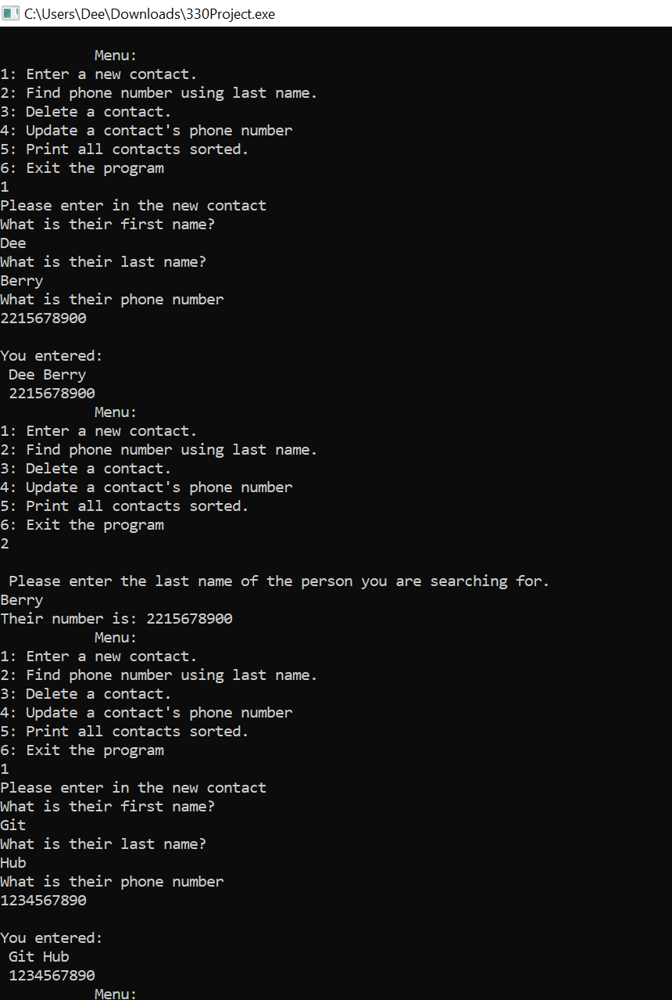
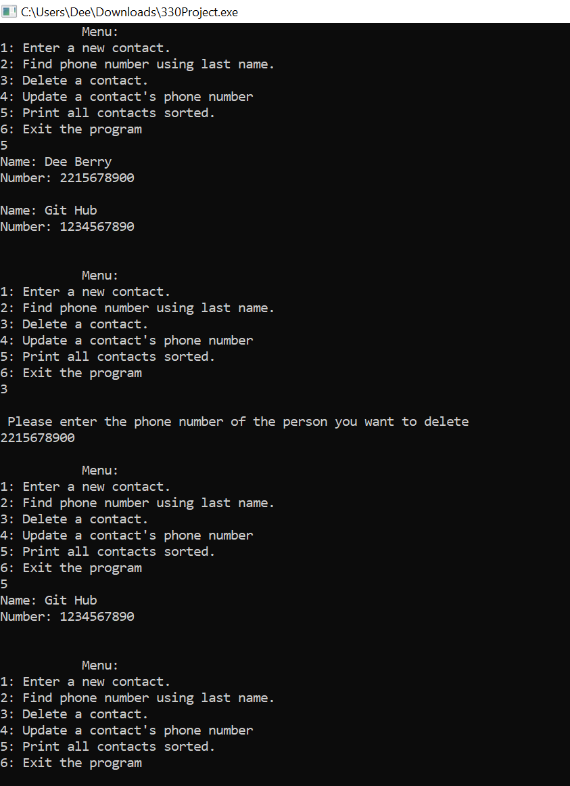

# VirtualPhonebook
Simple Contact Manager

This program was developed with C. 
It can Enter, Change, Delete, and Search Contacts. 
It uses a makefile to compile multiple C files at once. 

Makefile Compilation: 

Code Run: Screenshots of the running program using ubuntu

Code Run 2: Screenshots of the program using windows(no makefile)

